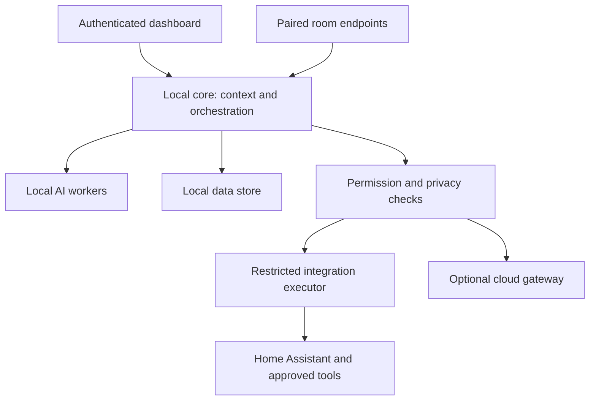

# JARVIS MASTER PROJECT SPECIFICATION v0.1

**Historical M0 design baseline.** Current progress (2026-09-28): the documentation PR is merged and Daniel requested the next step. The first M1 evaluation slice is described in [Milestone 1](milestones/001-local-alpha.md) and [ADR-0007](adr/0007-m1-local-alpha.md); its choices do not imply owner sign-off on every proposal below.

| Field | Value |
| --- | --- |
| Version | 0.1 |
| Date | 2026-09-16 |
| Project owner | Daniel |
| Repository | [danielsantos2310/jarvis](https://github.com/danielsantos2310/jarvis) |
| Status | Draft baseline, ready for owner review |
| Milestone | M0 — specification and development readiness |
| Implementation status | Documentation only; no application code, deployment or hardware purchase |

## 1. Vision

Build a personal assistant that feels present and helpful without demanding attention. JARVIS brings together conversation, useful widgets, selected personal information and home context. It explains what it knows, admits uncertainty, asks before sensitive actions, and stays usable when the internet is unavailable.

The first useful product runs on an existing PC. The eventual home system adds an always-on local hub, room sensors, microphones, speakers and optional displays. These are clients and sensors of the same permissioned system, rather than independent assistants with separate memories.

Success means Daniel can inspect his day, speak naturally, receive a well-timed reminder and control explicitly approved low-risk devices while retaining control over collection, memory, disclosure and actions. A futuristic HUD is a presentation option; clear state and dependable behavior take priority over animation.

## 2. Authority and assumptions

**Confirmed requirements:** local-first; modular; secure; proactive without intrusion; starts on one PC; expands across rooms; documentation before code. Earlier discussion also establishes the desired natural conversation, presence awareness and live widgets.

**Proposed choices:** TypeScript core and dashboard, local database, replaceable local speech/model services, Home Assistant integration, eventual Linux hub and ESPHome room sensors. These are engineering proposals, not previously approved purchases or established implementation facts.

PC operating system, CPU, RAM, GPU, available devices, household composition, budget and language priority are not confirmed. English and Brazilian Portuguese are candidate voice profiles; each needs separate evaluation. Do not infer the development OS from a browser user-agent. [Open decisions](governance/open-decisions-and-risks.md) identify owners and decision deadlines.

In this document, MUST is a release requirement, SHOULD is a default that needs a recorded reason to change, and MAY is optional. Numerical limits are proposed product targets, not measured results or vendor guarantees. Detailed documents own their defaults; this master summarizes them. A conflict must be resolved before implementation, with the stricter privacy or authorization rule used in the meantime.

## 3. Product principles and boundaries

1. **Local authority:** identity, permissions, context, memory and action decisions reside at home. Core functions require no cloud account.
2. **Explicit disclosure:** cloud use is off by default, visible when active, and limited by purpose, data class and provider consent.
3. **Bounded agency:** a language model proposes; deterministic software authorizes and executes.
4. **Uncertainty is a state:** occupied, identified and authenticated mean different things. Missing observations are not proof of absence.
5. **Attention is a resource:** quiet hours, focus mode, audience privacy and interruption limits constrain proactivity.
6. **Replaceable modules:** providers and device integrations use versioned contracts, never direct database sharing.
7. **Manual control survives:** mute, stop, revoke, delete and conventional device controls remain available without AI.

Out of scope for v0.1: application implementation, a public hosted assistant, unrestricted desktop/shell automation, facial recognition, voice biometrics, continuous ambient transcription, purchases, autonomous messaging, locks/alarms/cooking/medical-device control, third-party plugin marketplace and multi-home synchronization. A later proposal must explicitly revisit each excluded capability; the roadmap is not authorization to enable it.

## 4. User experience and requirements

The core dashboard presents connection state, microphone state, local/cloud processing mode, action approvals, notifications and configurable widgets. Initial widgets cover assistant status, local tasks and timers. Calendar, weather, PC status, home state and project-specific views follow through explicit integrations.

Users can ask a question, inspect an answer's provenance, create a local reminder, correct a memory, pause suggestions and see why an interruption was proposed. External data is marked with source and age. Private information is hidden on shared displays and during uncertain audience conditions.

The first technical slice is typed interaction and read-only views with the permission boundary already present. Voice follows as a local pipeline, then sensing, context, bounded proactivity and narrowly scoped actions. A permissions skeleton is required from M1; it is not deferred until actions arrive.

The [requirements register](requirements.md) gives stable identifiers, priorities, milestones and measurable acceptance criteria. Key targets include zero unauthorized writes in the release test suite, zero assistant egress in strict-local mode, local status updates within 500 ms at p95, and cancellation of speech within 500 ms at p95 on the selected reference hardware.

## 5. System architecture

JARVIS is a local service with a web dashboard, later an optional desktop shell and room endpoints. A modular monolith owns state and policy initially. Speech/model workers and credential-bearing integration executors run across process boundaries. This limits complexity without treating in-process modules as security sandboxes.

The diagram shows logical boundaries, not the exact number of machines. All requests, including dashboard clicks and deterministic routines, use the same authorization path. AI workers do not possess integration credentials. Cloud payloads pass a separate egress decision before leaving the home.

Internal events and API messages carry IDs, schema versions, source, scope, timestamps, expiry and provenance. The server stamps verified actor identity from authentication. MQTT is introduced only when device messaging is useful; audio has a dedicated stream. Reconnects reconcile current state and never replay old action commands blindly. [System detail](architecture/system.md).

## 6. Hardware architecture

**Stage A:** reuse the PC, screen, microphone/headset and speakers already available. No server purchase is required for M0 or initial typed interaction. PC sleep means the assistant is unavailable; it must not claim always-on service.

**Stage B:** add one consented test room with a presence sensor and paired endpoint. ESP32 plus an LD2410-family sensor is a candidate sensing path. Audio may require a separate capable endpoint; a generic ESP32 sensor board is not assumed to provide usable far-field audio, echo cancellation or local AI.

**Stage C:** move core and data to a measured, appropriately sized Linux home hub. PCs become clients; room satellites remain thin. Use wired networking for the hub where possible and segmented device access. An optional UPS supports orderly shutdown, not guaranteed continuity.

Planning envelopes are 16 GB host RAM for a comfortable single-PC pilot and 16–32 GB for a hub trial, subject to actual OS and model load. These are evaluation starting points, not purchase requirements. GPU, microphone array and acoustic hardware decisions follow benchmarks. [Hardware plan](architecture/hardware.md).

## 7. Software stack

| Layer | Proposed baseline | Boundary |
| --- | --- | --- |
| Dashboard | React, Next.js, TypeScript | Self-hosted; no mandatory hosting vendor |
| Core | Node.js supported LTS, TypeScript, Fastify | Domain services, scheduling, policy and API |
| Contracts | JSON Schema and OpenAPI; versioned events | Validated at every process boundary |
| Persistence | SQLite on a local disk, migrations | One core writer; no network-shared database file |
| Speech | whisper.cpp STT; Piper TTS candidates | Local workers; licensing and language evaluation required |
| Local language model | llama.cpp candidate behind an adapter | Optional for deterministic commands; model not yet selected |
| Home integration | Home Assistant | Executor allowlist, separate credentials |
| Room sensing | ESPHome | Per-device provisioning and encrypted links |
| Device events | MQTT/Mosquitto when needed | Authenticated clients and topic ACLs |
| Desktop shell | Tauri/Rust later, if needed | Explicit native capabilities; no general shell tool |
| Home deployment | Linux and Docker Compose | Native host audio agent where necessary |
| Remote access | Optional private VPN | Still requires application authentication |

PostgreSQL is an upgrade option if measured contention or multiple writers justify it. Hosted Supabase is not a baseline dependency. Exact compatible package versions are pinned at M1 after support and security review. [Selection rationale and alternatives](architecture/software-stack.md).

## 8. Security and AI permissions

Trust boundaries include the browser, core, model workers, integration executor, IoT network and optional providers. Threats include prompt injection, a malicious webpage or message, spoofed presence, compromised widgets, replayed commands, token theft, dependency compromise and physical access.

Default deny applies to every capability. Grants bind actor, operation, resource, constraints and expiry. The policy engine checks trusted identity, audience, resource freshness, action risk and consent. Approvals bind an exact normalized action digest and are single-use and short-lived. Changes to recipients, content or targets invalidate approval.

| Level | Examples | Default |
| --- | --- | --- |
| P0 | Local public status and help | Allowed within session and audience scope |
| P1 | Private read, calendar summary, personal memory retrieval | Scoped opt-in and authenticated private channel |
| P2 | Local reminder, one approved light, local memory save | Explicit request or narrowly approved routine |
| P3 | External communication, external write, bulk deletion | Disabled initially; later exact preview and fresh authenticated approval |
| P4 | Arbitrary shell, permission changes by AI, dangerous actuators | Unavailable to AI in this specification |

Speaking sensitive data and sending it to a model are disclosure actions even when no database is modified. A room sensor, remembered preference, voice match or model confidence cannot confer authorization. The system must never interpret a malicious email as an instruction from the user.

Host encryption, credential protection, authenticated encrypted LAN transport, audit metadata, device revocation, dependency review and a global automation stop are required. Root compromise remains outside what application isolation can fully defend. [Security](governance/security.md) and [AI permission model](governance/ai-permissions.md).

## 9. Privacy model

Collect the least data necessary. Raw microphone audio is transient in memory and is not retained by default. Transcripts are session-only by default; explicit history opt-in has a seven-day default. Presence stores current state without a movement history by default. User-approved long-term memory is inspectable, editable and deletable.

Consent is granular: microphone capture, room sensing, personal integrations, long-term memory, proactivity and each cloud purpose are separate. A household owner cannot silently opt other people into personal profiling. Unknown visitors receive guest-safe behavior. No camera or biometric identification is part of the baseline.

Deletion must cover source records, derived summaries, search indexes and caches. Encrypted backups have a bounded lifecycle and restore-time deletion replay. Secrets never enter prompts or analytics. This is an engineering privacy design, not a claim of legal certification. [Retention and data-flow rules](governance/privacy.md).

## 10. Presence detection

Maintain three separate facts: room occupancy, possible person/device association, and authenticated session. Combine fresh sensor signals with hysteresis, timeouts and source health. Phone/BLE proximity is supporting evidence only; a phone may remain in a room without its owner. Sensor failure produces unknown, not vacant.

Occupancy may change widget layout or make a generic greeting eligible. Personal content requires a private authenticated channel; uncertain identity never results in spoken calendar or message details. Multiple possible occupants suppress personal spoken output. Calibration includes still occupants, adjacent rooms, pets/fans, device-left-behind and sensor disconnects. [Presence states and targets](architecture/presence.md).

## 11. Voice architecture

Capture → local voice activity detection → local speech recognition → intent/context → policy → answer or action → local speech synthesis. Use deterministic routing for simple commands and timers; an LLM is not necessary for every request.

Push-to-talk provides the initial activation mechanism. Optional local wake-word activation follows. Natural conversation without repeating a wake word uses a clearly indicated, time-bounded conversation session after deliberate activation. Fully ambient activation remains research-only until consent, false activation and audience tests pass; presence alone never silently starts recording.

Mute, speaking, processing, listening and cloud transfer are visibly distinct. Stop and barge-in take precedence over conversational completion. A room coordinator selects one responding endpoint and prevents duplicate playback. English and Portuguese recognition, noise and echo require separate tests. [Voice protocol and failure behavior](architecture/voice.md).

## 12. Context and proactivity

The context engine assembles scoped facts with origin, freshness, confidence and visibility. It separates observations, user-confirmed preferences, short conversation context and durable memory. Retrieved documents and model-produced summaries remain untrusted data.

Candidate suggestions pass deterministic gates for consent, relevance, freshness, audience, interruptibility, cooldown and notification budget. The LLM may phrase a permitted suggestion but cannot decide to bypass quiet hours or create an action grant. Proactivity starts off; shadow mode records redacted reasons during evaluation. Proposed opt-in limits are two unsolicited suggestions per hour and six per day, with at most one unsolicited spoken suggestion per hour. Explicitly scheduled reminders use their own delivery settings.

Examples: offer an upcoming-event reminder on a private dashboard; show a silent system issue; defer a greeting during a call. An uncertain room audience receives no personal content. Every suggestion includes “why now,” dismiss, snooze and disable controls. [Context engine](architecture/context.md).

## 13. Widgets

Each widget declares ID, version, contract version, data scopes, action capabilities, refresh budget, privacy class and supported sizes. Core APIs authorize both initial data and live subscriptions. Widgets use an action request API and cannot hold provider secrets, access the database or call devices directly.

Built-in widgets are reviewed trusted application code. Third-party executable widgets are deferred until actual process/origin isolation is designed; a manifest alone is not a sandbox. Private data is excluded from public display responses, not merely hidden in CSS. [Widget lifecycle](architecture/widgets.md).

## 14. Data model

Core entities include Household, User, Room, Device, Session, Consent, CapabilityGrant, PresenceObservation, PresenceState, ContextFact, MemoryItem, ConversationSession, ActionRequest, Approval, ActionExecution, Notification, WidgetInstance, Integration and AuditEvent. Household and user scope are enforced on each read, write, subscription and retrieval.

The local relational store is authoritative. Search indexes and embeddings, if later introduced, are derived and deletable. UTC instants, IANA time zones and explicit recurrence semantics support daylight-saving changes. Durable action intent and execution receipts support recovery without claiming universal exactly-once delivery. [Entity and event definitions](architecture/data-model.md).

## 15. Deployment and testing

M1 uses loopback-only local development with synthetic data. M2 validates local speech on confirmed hardware. LAN use requires authentication, trusted HTTPS and device pairing. The eventual Linux hub uses separate services and durable local volumes, non-root execution where practical, explicit network rules and encrypted backups. Installation downloads may need internet; a provisioned strict-local system must run without it.

Test layers cover domain behavior, contracts, integrations, security adversaries, privacy lifecycle, noisy voice/presence hardware, accessibility, offline operation, upgrade and recovery. A reference workload and dataset accompany performance results. Release gates block unresolved high-severity authorization or disclosure defects. Targets include RPO ≤24 hours and RTO ≤2 hours for a tested household backup restore; they are not achieved claims. [Deployment](architecture/deployment.md), [testing](testing.md).

## 16. ADRs, phases and roadmap

ADRs record context, options, decision, consequences, validation and status. All initial implementation ADRs are **Proposed**; acceptance is recorded by the owner with date and evidence. User requirements do not become optional because a technical ADR is pending.

| Milestone | Outcome | Exit evidence |
| --- | --- | --- |
| M0 | Reviewable specification and plan | Documentation review, open decisions assigned, owner baseline acceptance |
| M1 | Secure local foundation | Authenticated dashboard, policy denial tests, local persistence and offline slice |
| M2 | Local conversation | Speech evaluation, stop/mute tests, session expiry |
| M3 | Presence and selected reads | Calibrated room sensing, guest-safe displays, read scopes |
| M4 | Context and bounded proactivity | Shadow-mode results, attention limits, memory deletion |
| M5 | Approved low-risk actions | Exact grants, execution receipts, replay and revocation tests |
| M6 | Multi-room home pilot | Pairing, room arbitration, outage and hub migration tests |

Cloud enhancements, desktop packaging and PostgreSQL are conditional branches rather than prerequisites. There are no committed dates before hardware and available development time are known. [Roadmap](roadmap.md) and [M0 work package](milestones/000-foundation.md).

## 17. Evidence and next gate

Technical sources are primary vendor/project documentation and OWASP guidance, recorded with access date and applicability in the [source register](sources.md). Architecture selections, privacy defaults and acceptance thresholds are project proposals derived from the requirements; external sources do not validate measured performance or guarantee security.

Next: review the baseline, complete the PC inventory, select the first three workflows, resolve M1-blocking decisions and record acceptance. Creating this document does not authorize application implementation or automatically complete those owner decisions.
