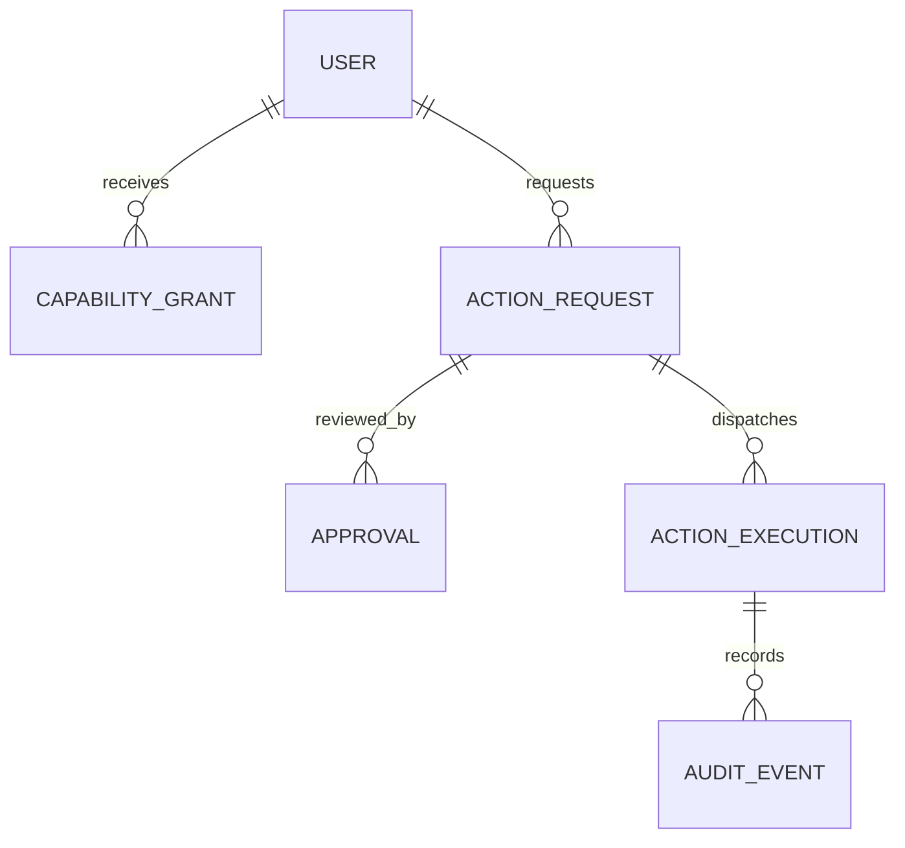

# Data model and lifecycle

Version 0.1 · Logical model only. No database schema or migration is implemented in M0.

## Authoritative entities

| Entity | Key fields beyond opaque ID | Ownership / retention |
| --- | --- | --- |
| Household | name, timezone, policy_version | Installation scope |
| User | household_id, display_name, role, locale, auth_ref, disabled_at | Private profile; no embedded provider secrets |
| Room | household_id, label, privacy_mode, sensing_consent_ref | Household |
| Device | household_id, room_id, type, key_ref, firmware, paired_at, revoked_at, last_seen | Household; key material outside DB |
| Session | user_id, client_id, auth_time, expires_at, revoked_at, channel_class | Short-lived; session secret hashed/protected |
| Consent | subject_id, purpose, data_classes, provider_id, scope, policy_version, granted_at, revoked_at | Subject-scoped, versioned |
| CapabilityGrant | subject_id, capability, resource_selector, constraints, expiry, version, revoked_at | Policy authority; explicit issuer |
| PresenceObservation | source_id, room_id, observed_at, received_at, ttl, sequence, value, evidence_quality | RAM by default; diagnostic retention only by consent |
| PresenceState | room_id, occupancy, candidate_subject_ids, evidence_refs, updated_at, expires_at | Latest state; unknown on startup until refreshed |
| ContextFact | subject_id, type, value, source_ref, dependencies, trust, class, expiry | Scoped; transient unless explicitly durable |
| MemoryItem | owner_id, content, provenance, confirmed_at, visibility, review_at, expires_at | User-approved durable memory |
| ConversationSession | user_id nullable, endpoint_id, mode, start, expires_at, history_consent_ref | Transient by default; authenticated context separate |
| Task / Reminder | owner_id, title, status, due_at, timezone, recurrence, missed_policy, delivery_policy | Durable user intent |
| ActionRequest | actor_id, tool_version, normalized_payload_ref, payload_digest, target_version, risk, state, expiry | Sensitive pending payload short-lived |
| Approval | action_id, approver_id, session_id, digest, policy_version, nonce_hash, expires_at, consumed_at | One-use; body not copied into audit |
| ActionExecution | action_id, idempotency_key, attempt, dispatched_at, receipt_ref, outcome | Minimal durable record for reconciliation |
| Notification | subject_id, purpose, channel, audience, dedup_key, expires_at, state, reason_codes | Seven-day minimal history |
| WidgetInstance | owner/display_scope, widget_id, version, layout, settings, grants_refs | Layout/settings only, not source credentials |
| Integration | household/user scope, provider, secret_ref, capabilities, health, last_sync, revoked_at | Secret reference; cache separately classified |
| AuditEvent | actor, action_ref, decision, policy_version, timestamp, reason_codes, outcome | Redacted 30-day metadata |
| DeletionTombstone | record_id, scope, deleted_at, latest_backup_expiry | Minimal opaque IDs for restore hygiene |
| ArtifactVersion | component/model, version, hash, source, license, installed_at | Reproducibility and upgrade record |

## Important relationships

An action may have multiple expired/replaced approval records in its history, but at most one valid consumed approval per execution digest. Any payload change creates a new action revision and invalidates pending approval. A single action can have multiple attempts only under the documented idempotency policy. Audit events refer to IDs without duplicating sensitive content.

Household owns rooms and devices; users belong to a household; devices produce observations for their bound room; observations derive presence state and context facts. Memory belongs to a user unless explicitly shared. Consent and grants are separate: consent permits a purpose's data processing; a grant permits an operation on a resource.

## Storage and integrity

SQLite on local disk is the initial authority, accessed only by the core repository layer. Use foreign keys, unique constraints, parameterized queries, transactions and versioned migrations. One core process manages writes. Limit transaction duration and measure lock contention. No satellite mounts the database file; all clients use the API.

Use globally unique opaque IDs for entities, UTC timestamps for instants and IANA timezone IDs for display and recurrence. Store optimistic concurrency versions for mutable grants, settings and action targets. Validate payload size and schema on reads from external sources and writes into storage. Unknown schema versions fail with a clear compatibility error.

Authorization checks apply to list queries, individual records, full-text search, subscriptions and exports, not just detail screens. Every user-scoped entity carries household and owner scope. Model/worker processes receive bounded data through APIs and cannot query tables directly.

## Time and scheduling

Use wall-clock UTC for scheduled events and monotonic time for short session/approval deadlines. Detect major clock changes and expire approvals rather than extending them. For recurring local wall-clock reminders, store local time and IANA zone; proposed DST policy is to move a nonexistent time to the next valid instant and choose the first occurrence of an ambiguous repeated time. Show that policy at setup and allow an explicit alternate choice.

After downtime, a due reminder follows its saved policy: deliver once with a late label, keep in inbox or skip. Default is private inbox with a late label. Timer alarms may deliver once if no more than five minutes late; older ones move to inbox. Device commands expire and never catch up automatically.

## Data lifecycle and recovery

Do not persist raw audio or default transcripts. Store pending action bodies only as long as needed for approval/execution; clear them after terminal state unless a separately approved history purpose requires them. Keep hashes/receipt metadata without claiming that a hash anonymizes predictable personal text; use keyed digests where appropriate and avoid hashing secrets into logs.

Source deletion traverses dependency references to derived facts, summaries and future indexes. Backups use a consistent database snapshot API or equivalent safe procedure; copying a live SQLite file alone is not a sufficient backup plan. Restore replays deletion tombstones before reopening clients and invalidates sessions, grants requiring revalidation and outstanding approvals. [SQLite backup API](https://www.sqlite.org/backup.html).

A PostgreSQL migration requires an ADR, schema/data validation, staged cutover and rollback backup. Export canonical IDs and UTC times without promising transparent SQL compatibility. Test ownership, counts, constraints and deletion behavior before switching the single authority.
