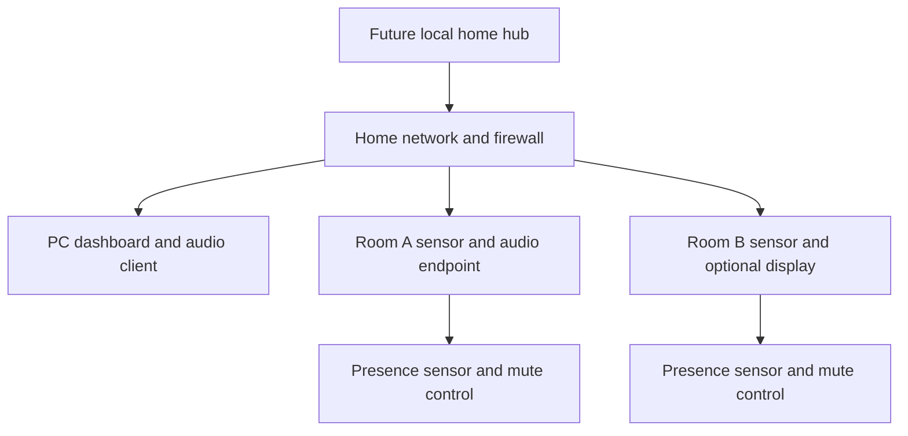

# Hardware architecture and evaluation plan

Version 0.1 · All hardware choices are candidates; no purchase is approved by this document.

## Staged topology

During the one-PC phase the PC also hosts the hub functions. Moving the core later does not move microphones into the hub or require displays in every room. Sensor and audio endpoints may be separate physical devices.

## Roles and planning envelopes

| Role | Initial candidate | Evaluation requirement |
| --- | --- | --- |
| Existing PC | Current OS, CPU and peripherals | Inventory first; typed core must run without a GPU |
| Voice pilot | Existing USB mic/headset and speaker | Measured noise, latency, mute and echo behavior |
| Core memory budget | Core/UI target ≤1 GB idle excluding workers/browser | Measure before adding inference workloads |
| PC/hub RAM planning | 16 GB pilot; 16–32 GB hub trial | Not a minimum guarantee; account for OS, models, concurrency and headroom |
| Storage | Local SSD, encrypted OS volume | Estimate selected model weights + data quota + backup staging + 25% free-space headroom |
| Local inference accelerator | CPU first; existing GPU if compatible | Record model, quantization, VRAM, context size and measured latency before choosing hardware |
| Presence node | ESP32-family board plus LD2410-family sensor | Exact board, voltage, UART and firmware compatibility checked before wiring |
| Room audio endpoint | Supported voice endpoint or small computer | Verify microphone interface, local activation, playback, indicator, echo handling and transport |
| Network | Wired hub; Wi-Fi room devices as needed | Room coverage, segmentation and outage tests |
| Power | Rated supplies; optional hub UPS | Safe enclosure, cable strain relief and tested shutdown behavior |

Do not assume an ESP32 board running presence firmware also has sufficient audio hardware, memory or firmware support for the chosen voice pipeline. ESPHome documents LD2410 support and UART requirements; sensor variant selection still needs its actual datasheet and board pinout. [ESPHome LD2410](https://esphome.io/components/sensor/ld2410/).

## Phase A — one PC

Complete the [inventory](../templates/hardware-inventory.md), including OS, RAM, disk, CPU, GPU/VRAM, available microphone, speaker/headphone, network, power/sleep and encryption. Use a headset for the first speech benchmark to establish a clean reference. The typed alpha does not need new sensors or a server.

Test loopback dashboard and microphone permissions on the actual OS/browser. If development uses WSL or containers, browser capture remains on the host and model/core services may run inside the chosen environment. USB audio and Bluetooth passthrough are not assumed to work automatically. Native background access may later justify a small host agent.

## Phase B — one instrumented room

Start with one room, one observation source and deliberate voice activation. Register the sensor's room and mounting location. Calibrate distances/sensitivity against seated still users, empty-room noise, fans, pets and neighboring rooms. Add optional consented phone/BLE signals only after occupancy behavior is measured.

Every microphone endpoint has a recognizable listening indicator and a reachable mute. Prefer hardware mute that disconnects capture rather than an LED driven only by application state. Validate that the indicator matches actual capture and transport. A generic proximity sensor cannot reliably count or identify all occupants.

## Phase C — home hub and additional rooms

Choose a Linux machine only after a two-concurrent-session load test and 25% resource headroom assessment. The hub needs physical protection, recoverable encryption keys and a power-restoration policy. An unlocked unattended encrypted hub remains exposed to host compromise; full-disk encryption mainly protects an offline stolen disk.

Give each endpoint its own identity, firmware version, room binding and revocation path. Avoid deploying all rooms at once: add one, run the acceptance checklist, then continue. Multi-room audio requires echo/feedback control, room arbitration and turn ownership; network connectivity alone does not solve those problems.

## Purchase gate

No shopping list is final until the existing inventory, pilot language/latency result, room layout, microphone quality, electrical compatibility and total budget are known. Record alternatives, supplier specifications, power consumption estimates, support life and return/repair options in the hardware ADR update. Exact vendor prices and stock are intentionally not asserted here.
