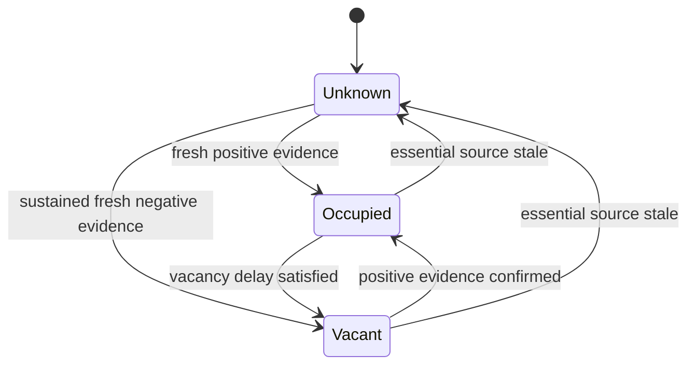

# Presence detection

Version 0.1 · Candidate one-room implementation, then multi-room calibration.

## Three separate state dimensions

| Dimension | States / values | Can authorize personal access? |
| --- | --- | --- |
| Occupancy | unknown, vacant, occupied | No |
| Person association | none, candidate set, ambiguous | No; evidence only |
| Authenticated actor | valid session and capability grants, or none | Yes, within channel and resource constraints |

Store confidence and evidence alongside states, but never present an uncalibrated score as a probability that Daniel is present. An unlocked signed-in PC is an authenticated client; it does not establish that every person in the room may hear its private content.

## Signals

| Signal | Useful evidence | Known limitation |
| --- | --- | --- |
| mmWave/LD2410 | Presence/movement in a calibrated zone | Not personal identity; placement and reflections matter |
| PIR, optional | Recent movement | Still occupants may be missed |
| Consented phone/BLE | A registered device may be nearby | Phone can be left behind; RSSI crosses rooms; address behavior varies |
| Manual room check-in | Explicit user statement | Expires; still not a blanket audience guarantee |
| PC lock/idle, opt-in | Interaction/focus hint at one client | Does not mean entire room is empty or private |
| Device heartbeat | Sensor availability | Health is not occupancy |

Use ESPHome's supported BLE mechanisms rather than assuming a permanent visible phone MAC address. The actual phone/OS and beacon mode must be tested. [ESPHome BLE presence](https://esphome.io/components/binary_sensor/ble_presence/).

## Fusion and freshness

Devices report state changes immediately and send a health/state heartbeat even without changes. Proposed starting parameters for a 10-second heartbeat: observations become stale after 30 seconds without expected refresh; BLE association evidence expires after 60 seconds. A fresh positive occupancy signal sustained for two seconds enters occupied. Sustained fresh negative readings for 120 seconds permit vacant. Missing or conflicting essential inputs produce unknown; they never count as negative observations.

Only calibrated occupancy-capable signals decide vacancy. BLE may suggest an association but does not maintain occupancy indefinitely when a phone is left behind. A reboot begins unknown. Hysteresis avoids flapping. Keep source timestamp and trusted receive timestamp; reject future-dated or replayed data outside a five-second skew tolerance for tightly timed fusion, and flag device clock health. Use server receive time when a sensor has no trustworthy clock.

These are initial tuning values, not sensor specifications. Record actual heartbeat, thresholds and false-positive/false-negative results per room. A device's room is bound during pairing; a client cannot choose another room by changing its event payload.

## Behavior consequences

Occupied may enable a generic dashboard wake or make a consented greeting eligible; the attention engine still decides whether to deliver it. Unknown suppresses personal proactivity. Vacancy does not authorize turning off equipment or deleting context. Device actuation requires its own grant and safety policy.

Candidate identity can personalize a non-sensitive suggestion ranking only if the person has consented. Personal readings default to an authenticated private display/headphones. No shared endpoint treats an absence of detected guests as proof of privacy. A shared-room personal conversation requires explicit private-session affirmation and ends on ambiguity.

Multi-room association holds a candidate set rather than forcing one room. Do not tell the user a person is in room A solely because its BLE signal is strongest. Movement of a conversation requires an explicit authenticated handoff, not just a change in proximity.

## Calibration and acceptance

For each room, record at least 20 entry/exit transitions, 30 minutes of a seated still occupant, 30 minutes empty with common noise sources, adjacent-room movement, phone left behind, multiple people, and sensor disconnect/reconnect. Obtain participant consent and avoid storing identifiable audio/video for these tests.

Initial target: at least 19/20 entries detected within three seconds after the positive-evidence threshold; vacancy within 150 seconds after true exit on healthy sensors; no false vacancy during the still-person test; stale source → unknown within 30 seconds; zero private disclosures in guest/ambiguity tests. Recalibrate or defer dependent automation when thresholds are missed. Test counts establish pilot evidence, not universal detection accuracy.
