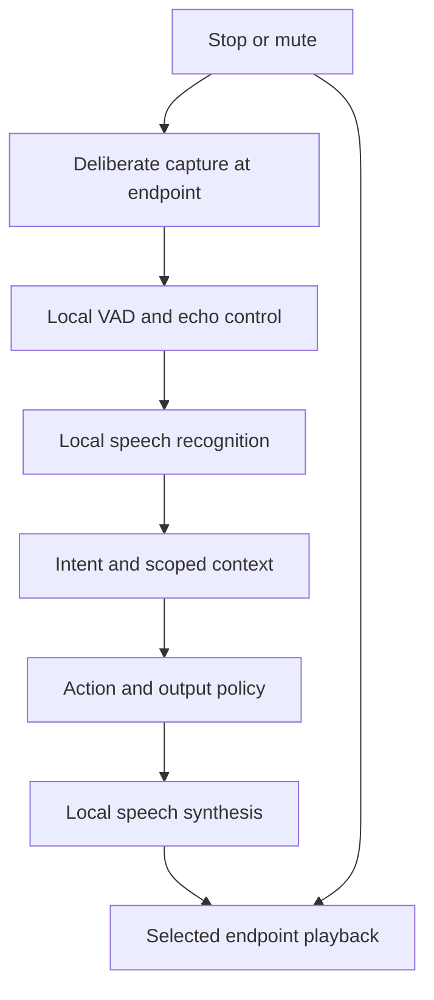

# Voice architecture

Version 0.1 · Local pipeline first; optional external providers require a separate ADR and consent gate.

Implementation checkpoint: the [optional local voice test](../development/local-voice.md) now provides explicit capture, transcript review and requested spoken playback through loopback Wyoming workers. The session/VAD/multi-room design below remains a target; it is not all implemented.

## Processing path

Push-to-talk, local activation and silence detection happen as close to the endpoint as hardware permits. STT/TTS/model inference may run on the central PC or hub. Distinguish speech recognition from intent handling: recognized words are still untrusted input. A TV, recording or nearby guest must not gain sensitive authority by speaking a command.

Home Assistant documents local STT/TTS pipelines and Wyoming interoperability; JARVIS can adapt to those services without delegating its permission model. [Local voice pipeline](https://www.home-assistant.io/voice_control/voice_remote_local_assistant/), [Wyoming](https://www.home-assistant.io/integrations/wyoming/).

## Activation and session state

Modes are disabled, push-to-talk, optional local wake word and optional bounded follow-up. Default is push-to-talk. Wake mode requires explicit setup and an indicator; local pre-roll is limited to two seconds in RAM. An always-on wake detector processes ambient sound locally, but does not justify continuous recording or transcription.

States are muted, idle, listening, recognizing, thinking, awaiting-approval, speaking and follow-up. Each has a distinct visual state and accessible text label. Deliberate activation enters listening. Each utterance has a 30-second capture cap and an initial 800 ms silence endpoint target, tuned for the user's language and pauses. TTS completion may open a 20-second follow-up window if enabled; the conversation expires after five minutes total or on mute, stop, lock, audience ambiguity or explicit close. Timeout erases transient content under the privacy policy.

This supports conversation without repeating a wake word during the session. Unprompted ambient conversation initiation remains research-only. Presence can affect greeting eligibility; it cannot silently activate microphone capture. A user can always use typed input.

## Audio transport and cancellation

For one PC, browser/host capture sends bounded audio frames to the local speech adapter. For rooms, use a dedicated authenticated encrypted streaming connection with turn ID, endpoint ID, audio format, sequence, deadline and cancellation signal. Negotiate sample rate, channel count and codec with the chosen engine; do not assume one format for every worker. MQTT carries control/availability, not continuous audio.

Browser microphone capture depends on user permission and secure-context rules. Trusted local HTTPS is required for LAN browser clients. Do not instruct users to bypass browser security as a deployment method. [W3C Media Capture and Streams](https://www.w3.org/TR/mediacapture-streams/).

Stop cancels queued synthesis, halts current playback, cancels pending capture/inference where supported and closes follow-up. It does not imply reversal of an already executed external effect. Barge-in requires echo-aware detection so the assistant's own voice does not repeatedly activate itself. Use half-duplex interaction if echo cancellation is insufficient; do not claim natural full-duplex behavior until measured.

## Multi-room behavior

The coordinator assigns one endpoint a turn lease. Competing activations within a proposed 400 ms window are deduplicated using timing, room evidence and endpoint audio-quality estimates; do not save a voiceprint. Lease loss stops playback and forbids fresh sensitive actions. Initial lease duration is five seconds, renewed while the session is active.

Requests from different users may run concurrently within resource limits; response arbitration is per conversation, not a household-wide lock. If the speaker/room is ambiguous, ask for deliberate activation or show a private screen prompt. Private content does not automatically follow a person into another room. On hub disconnection, endpoints indicate unavailable and drop expired audio rather than replaying it on reconnect.

## Language, provider and failure policy

Evaluate English and Brazilian Portuguese separately; select the first language in M0. Avoid automatic language switching until both paths are tested. Runtime and voice-model licenses must be recorded. Local deterministic intents remain useful even if a free-form LLM is unavailable.

Cloud voice is off. A future provider must disclose audio/text sent, retention policy, active transfer state and cost limits. If local speech fails, offer text or an explicitly consented provider; no silent fallback. If TTS fails, show text. If STT confidence or target interpretation is uncertain, clarify without execution. Do not claim completion before an executor receipt.

Targets and tests: N-02–N-06, T-03, T-04, T-12, T-25 and T-28 in the [test plan](../testing.md). Record warm/cold response times, noise setup, language, hardware and model hash.
